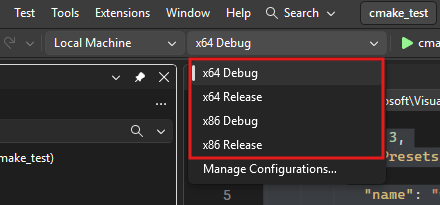
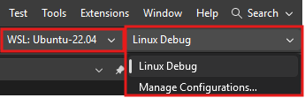
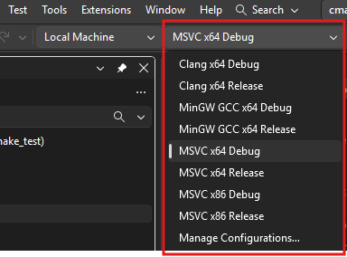

# CMake
CMake support has been integrated into Visual Studio for a few years now.  This means that it can now handle CMake projects natively.
This is a huge improvement over the previous method of using CMake with Visual Studio, which required a lot of manual configuration and setup.

<br>


## CMakePresets.json -vs- CMakeSettings.json
Thre are a couple of different ways to configure CMake in Visual Studio.  

1. A **CMakeSettings.json** file, which is a Visual Studio specific configuration file.
2. A **CMakePresets.json** file, which is a CMake specific configuration file.

{: .warning }
> CMakeSettings.json has now been deprecated in VS2026.
>
> CMakePresets.json file is now the preferred method of configuring CMake.
> It is more portable and can be used with other IDEs and build systems.


<br>


## Basic CMakePresets.json Example
Here is the default **CMakePresets.json** file that VS2026 spits out when you create a new CMake project.  It is located in the root of the project directory. 
<details markdown="1">
<summary class="summary-highlight">VS2026 Default CMakePresets.json</summary>

```json
{
    "version": 3,
    "configurePresets": [
        {
            "name": "windows-base",
            "hidden": true,
            "generator": "Ninja",
            "binaryDir": "${sourceDir}/out/build/${presetName}",
            "installDir": "${sourceDir}/out/install/${presetName}",
            "cacheVariables": {
                "CMAKE_C_COMPILER": "cl.exe",
                "CMAKE_CXX_COMPILER": "cl.exe"
            },
            "condition": {
                "type": "equals",
                "lhs": "${hostSystemName}",
                "rhs": "Windows"
            }
        },
        {
            "name": "x64-debug",
            "displayName": "x64 Debug",
            "inherits": "windows-base",
            "architecture": {
                "value": "x64",
                "strategy": "external"
            },
            "cacheVariables": {
                "CMAKE_BUILD_TYPE": "Debug",
                "CMAKE_PROJECT_TOP_LEVEL_INCLUDES": "$env{VSINSTALLDIR}Common7/IDE/CommonExtensions/Microsoft/CMake/cmake/Microsoft/SegmentHeap.cmake"
            }
        },
        {
            "name": "x64-release",
            "displayName": "x64 Release",
            "inherits": "x64-debug",
            "cacheVariables": {
                "CMAKE_BUILD_TYPE": "Release",
                "CMAKE_PROJECT_TOP_LEVEL_INCLUDES": "$env{VSINSTALLDIR}Common7/IDE/CommonExtensions/Microsoft/CMake/cmake/Microsoft/SegmentHeap.cmake"
            }
        },
        {
            "name": "x86-debug",
            "displayName": "x86 Debug",
            "inherits": "windows-base",
            "architecture": {
                "value": "x86",
                "strategy": "external"
            },
            "cacheVariables": {
                "CMAKE_BUILD_TYPE": "Debug",
                "CMAKE_PROJECT_TOP_LEVEL_INCLUDES": "$env{VSINSTALLDIR}Common7/IDE/CommonExtensions/Microsoft/CMake/cmake/Microsoft/SegmentHeap.cmake"
            }
        },
        {
            "name": "x86-release",
            "displayName": "x86 Release",
            "inherits": "x86-debug",
            "cacheVariables": {
                "CMAKE_BUILD_TYPE": "Release",
                "CMAKE_PROJECT_TOP_LEVEL_INCLUDES": "$env{VSINSTALLDIR}Common7/IDE/CommonExtensions/Microsoft/CMake/cmake/Microsoft/SegmentHeap.cmake"
            }
        },
        {
            "name": "linux-debug",
            "displayName": "Linux Debug",
            "generator": "Ninja",
            "binaryDir": "${sourceDir}/out/build/${presetName}",
            "installDir": "${sourceDir}/out/install/${presetName}",
            "cacheVariables": {
                "CMAKE_BUILD_TYPE": "Debug"
            },
            "condition": {
                "type": "equals",
                "lhs": "${hostSystemName}",
                "rhs": "Linux"
            },
            "vendor": {
                "microsoft.com/VisualStudioRemoteSettings/CMake/1.0": {
                    "sourceDir": "$env{HOME}/.vs/$ms{projectDirName}"
                }
            }
        },
        {
            "name": "macos-debug",
            "displayName": "macOS Debug",
            "generator": "Ninja",
            "binaryDir": "${sourceDir}/out/build/${presetName}",
            "installDir": "${sourceDir}/out/install/${presetName}",
            "cacheVariables": {
                "CMAKE_BUILD_TYPE": "Debug"
            },
            "condition": {
                "type": "equals",
                "lhs": "${hostSystemName}",
                "rhs": "Darwin"
            },
            "vendor": {
                "microsoft.com/VisualStudioRemoteSettings/CMake/1.0": {
                    "sourceDir": "$env{HOME}/.vs/$ms{projectDirName}"
                }
            }
        }
    ]
}

```
</details>

This file allows you to switch between:
* Different platforms (Windows, Linux and MacOS)
* Different architecture (x86 and x64)
* Different configurations (Debug and Release builds)

In VS2026, this is used to populate the **Configuration** pull-down menu in the toolbar:




If you change the platform to point to a Linux box (or WSL), the **Configuration** pull-down menu will change to show the Linux configurations:


<br>

## Different Compilers
Here is a different CMakePresets.json that allows VS2026 to use different compilers, such as Clang and GCC, in addition to the default MSVC compiler.

<details markdown="1">
<summary class="summary-highlight">CMakePresets.json for different compilers</summary>

```json
{
  "version": 3,
  "configurePresets": [
    {
      "name": "linux-base",
      "description": "Target the Windows Subsystem for Linux (WSL) or a remote system.",
      "hidden": true,
      "generator": "Ninja",
      "binaryDir": "${sourceDir}/out/build/${presetName}",
      "installDir": "${sourceDir}/out/install/${presetName}",
      "condition": {
        "type": "equals",
        "lhs": "${hostSystemName}",
        "rhs": "Linux"
      },
      "vendor": {
        "microsoft.com/VisualStudioRemoteSettings/CMake/2.0": {
          "remoteSourceRootDir": "$env{HOME}/.vs/$ms{projectDirName}",
          "copySourcesOptions": {
            "method": "rsync",
            "rsyncCommandArgs": "-t --delete --delete-excluded",
            "exclusionList": [ ".vs", ".git", "out" ]
          }
        }
      }
    },
    {
      "name": "linux-debug",
      "displayName": "Linux Debug",
      "description": "Target the Windows Subsystem for Linux (WSL) or a remote system. (Debug)",
      "inherits": "linux-base",
      "cacheVariables": {
        "CMAKE_BUILD_TYPE": "Debug"
      }
    },
    {
      "name": "linux-release",
      "displayName": "Linux Release",
      "description": "Target the Windows Subsystem for Linux (WSL) or a remote system. (Release)",
      "inherits": "linux-base",
      "cacheVariables": {
        "CMAKE_BUILD_TYPE": "Release"
      }
    },
    {
      "name": "macos-debug",
      "displayName": "macOS Debug",
      "description": "Target a remote macOS system.",
      "generator": "Ninja",
      "binaryDir": "${sourceDir}/out/build/${presetName}",
      "installDir": "${sourceDir}/out/install/${presetName}",
      "cacheVariables": {
        "CMAKE_BUILD_TYPE": "Debug"
      },
      "condition": {
        "type": "equals",
        "lhs": "${hostSystemName}",
        "rhs": "Darwin"
      },
      "vendor": { "microsoft.com/VisualStudioRemoteSettings/CMake/1.0": { "sourceDir": "$env{HOME}/.vs/$ms{projectDirName}" } }
    },
    {
      "name": "msvc-x64-base",
      "description": "Hidden base for Windows x64 MSVC Ninja builds.",
      "hidden": true,
      "generator": "Ninja",
      "binaryDir": "${sourceDir}/out/build/${presetName}",
      "installDir": "${sourceDir}/out/install/${presetName}",
      "architecture": {
        "value": "x64",
        "strategy": "external"
      },
      "cacheVariables": {
        "CMAKE_C_COMPILER": "cl.exe",
        "CMAKE_CXX_COMPILER": "cl.exe"
      },
      "condition": {
        "type": "equals",
        "lhs": "${hostSystemName}",
        "rhs": "Windows"
      },
      "vendor": {
        "microsoft.com/VisualStudioSettings/CMake/1.0": {
          "hostOS": [ "Windows" ],
          "intelliSenseMode": "windows-msvc-x64"
        }
      }
    },
    {
      "name": "msvc-x64-debug",
      "displayName": "MSVC x64 Debug",
      "description": "Target Windows (64-bit) with MSVC. (Debug)",
      "inherits": "msvc-x64-base",
      "cacheVariables": {
        "CMAKE_BUILD_TYPE": "Debug"
      }
    },
    {
      "name": "msvc-x64-release",
      "displayName": "MSVC x64 Release",
      "description": "Target Windows (64-bit) with MSVC. (RelWithDebInfo)",
      "inherits": "msvc-x64-base",
      "cacheVariables": {
        "CMAKE_BUILD_TYPE": "RelWithDebInfo"
      }
    },
    {
      "name": "msvc-x86-base",
      "description": "Hidden base for Windows x86 MSVC Ninja builds.",
      "hidden": true,
      "generator": "Ninja",
      "binaryDir": "${sourceDir}/out/build/${presetName}",
      "installDir": "${sourceDir}/out/install/${presetName}",
      "architecture": {
        "value": "x86",
        "strategy": "external"
      },
      "cacheVariables": {
        "CMAKE_C_COMPILER": "cl.exe",
        "CMAKE_CXX_COMPILER": "cl.exe"
      },
      "condition": {
        "type": "equals",
        "lhs": "${hostSystemName}",
        "rhs": "Windows"
      },
      "vendor": {
        "microsoft.com/VisualStudioSettings/CMake/1.0": {
          "hostOS": [ "Windows" ],
          "intelliSenseMode": "windows-msvc-x86"
        }
      }
    },
    {
      "name": "msvc-x86-debug",
      "displayName": "MSVC x86 Debug",
      "description": "Target Windows (32-bit) with MSVC. (Debug)",
      "inherits": "msvc-x86-base",
      "cacheVariables": {
        "CMAKE_BUILD_TYPE": "Debug"
      }
    },
    {
      "name": "msvc-x86-release",
      "displayName": "MSVC x86 Release",
      "description": "Target Windows (32-bit) with MSVC. (Release)",
      "inherits": "msvc-x86-base",
      "cacheVariables": {
        "CMAKE_BUILD_TYPE": "Release"
      }
    },
    {
      "name": "mingw_x64_base",
      "description": "Target MinGW GCC",
      "hidden": true,
      "generator": "Ninja",
      "binaryDir": "${sourceDir}/out/build/${presetName}",
      "installDir": "${sourceDir}/out/install/${presetName}",
      "cacheVariables": {
        "CMAKE_C_COMPILER": "x86_64-w64-mingw32-gcc.exe",
        "CMAKE_CXX_COMPILER": "x86_64-w64-mingw32-g++.exe"
      },
      "condition": {
        "type": "equals",
        "lhs": "${hostSystemName}",
        "rhs": "Windows"
      },
      "vendor": {
        "microsoft.com/VisualStudioSettings/CMake/1.0": {
          "hostOS": [ "Windows" ],
          "intelliSenseMode": "windows-gcc-x64"
        }
      }
    },
    {
      "name": "mingw-gcc-x64-debug",
      "displayName": "MinGW GCC x64 Debug",
      "description": "Target Windows (64-bit) MinGW GCC. (Debug)",
      "inherits": "mingw_x64_base",
      "architecture": {
        "value": "x64",
        "strategy": "external"
      },
      "cacheVariables": {
        "CMAKE_BUILD_TYPE": "Debug"
      }
    },
    {
      "name": "mingw-gcc-x64-release",
      "displayName": "MinGW GCC x64 Release",
      "description": "Target Windows (64-bit) with MinGW GCC. (Release)",
      "inherits": "mingw_x64_base",
      "architecture": {
        "value": "x64",
        "strategy": "external"
      },
      "cacheVariables": {
        "CMAKE_BUILD_TYPE": "Release"
      }
    },
    {
      "name": "clang-cl-x64-base",
      "description": "Hidden base for Windows x64 Clang-CL Ninja builds.",
      "hidden": true,
      "generator": "Ninja",
      "binaryDir": "${sourceDir}/out/build/${presetName}",
      "installDir": "${sourceDir}/out/install/${presetName}",
      "architecture": {
        "value": "x64",
        "strategy": "external"
      },
      "cacheVariables": {
        "CMAKE_C_COMPILER": "clang-cl.exe",
        "CMAKE_CXX_COMPILER": "clang-cl.exe"
      },
      "condition": {
        "type": "equals",
        "lhs": "${hostSystemName}",
        "rhs": "Windows"
      },
      "vendor": {
        "microsoft.com/VisualStudioSettings/CMake/1.0": {
          "hostOS": [ "Windows" ],
          "intelliSenseMode": "windows-clang-x64"
        }
      }
    },
    {
      "name": "clang-cl-x64-debug",
      "displayName": "Clang x64 Debug",
      "description": "Target Windows (64-bit) with Clang-CL. (Debug)",
      "inherits": "clang-cl-x64-base",
      "cacheVariables": {
        "CMAKE_BUILD_TYPE": "Debug"
      }
    },
    {
      "name": "clang-cl-x64-release",
      "displayName": "Clang x64 Release",
      "description": "Target Windows (64-bit) with Clang-CL. (Release)",
      "inherits": "clang-cl-x64-base",
      "cacheVariables": {
        "CMAKE_BUILD_TYPE": "Release"
      }
    }
  ]
}
```
</details>

In addition to allowing you to switch between different platforms, architectures and configurations, this file also allows you to switch between different compilers:
* MSVC
* Clang
* GCC



<br>