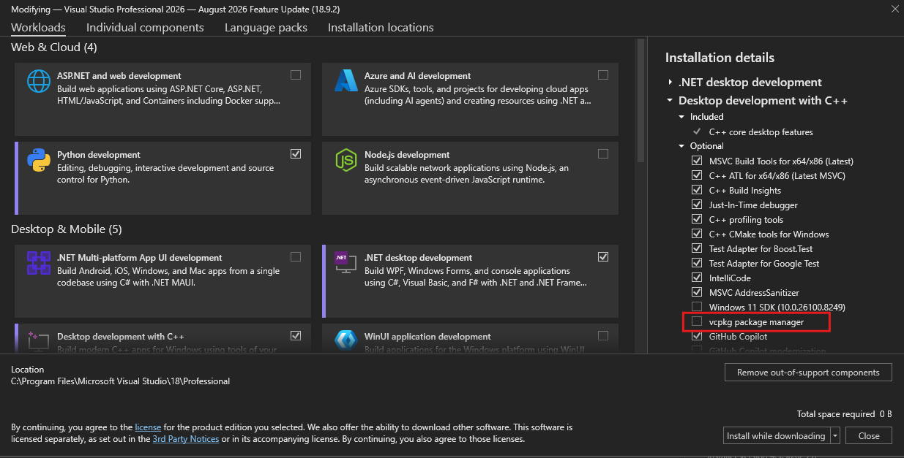

# VCPKG
VCPKG is a package and dependency manager for C/C++ libraries.

On Linux, when packages are installed the various files got into the known system directories (e.g. `/usr/include`, `/usr/lib`, etc.).  
This is not the case on Windows.  Each package is installed into its own directory, and the user is expected to set the include and library paths in their project settings.
This is a pain, and it is easy to forget to set the paths, or to set them incorrectly.  Its compounded even more when there are multiple people working on the same project,
and each person has to set the paths on their own machine.  This can lead to a lot of wasted time and frustration.

VCPKG aims to solve this problem by providing a tool that can be used to install packages, and then automatically set the include and library paths in Visual Studio.


## Installation
VCPKG can be installed in a couple of different ways:
1. Via <https://github.com/microsoft/vcpkg>
2. Via the Visual Studio Installer:


<br>


## Setup Environment Variable
Once it has been installed you need to set the `VCPKG_ROOT` environment variable to point to the root of your VCPKG installation directory.
<br>


## CMake Integration
In order for CMake to find the packages installed by VCPKG, you need to set the `CMAKE_TOOLCHAIN_FILE` variable to point to the `vcpkg.cmake` file in your VCPKG installation directory.
The easiest way to do this is to add it to your `CMakePresets.json` file, like this:
```json
{
  "configurePresets": [
	{
	  ...
	  ...
	  ...
	  "cacheVariables": {
		"CMAKE_TOOLCHAIN_FILE": "${env.VCPKG_ROOT}/scripts/buildsystems/vcpkg.cmake"
	  }
	  ...
	  ...
	}
  ]
}
```